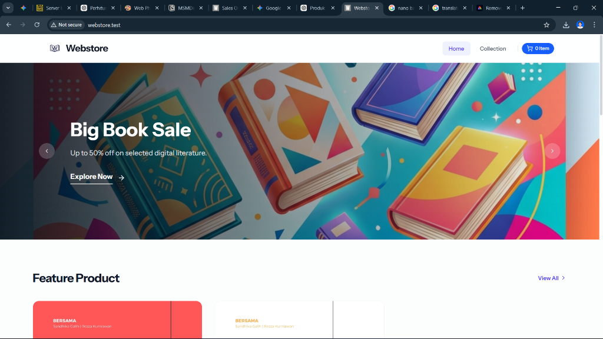

# 📚 Webstore - Modern Digital Bookstore & Literature Platform

[](https://laravel.com)
[](https://livewire.laravel.com)
[](https://tailwindcss.com)
[](https://filamentphp.com)

Welcome to **Webstore**, a modern e-commerce bookstore platform specifically designed to connect literature lovers with their best curated books. From fiction novels, self-improvement books, to the latest digital literary works, Webstore exists as a beautiful, reactive, and premium digital reading and shopping space.

---

## 🖥️ Webstore Interface

Here is the original interface of the **Webstore** platform:



*The Webstore homepage interface with an interactive **Big Book Sale** promotional banner and an attractive **Featured Product** lineup.*

---

## 🎯 What is Webstore For?

**Webstore** was built to address the boredom of slow and rigid online book shopping. This platform simplifies the entire book purchasing flow into an enjoyable experience for buyers, while providing full control for bookstore owners.

### 🌟 For Readers & Book Buyers:
- **Limitless Book Exploration**: Browse the book catalog with instant search by title, author, genre, or custom promotion tags.
- **Reactive Shopping Cart**: Add, change quantities, or remove selected books from your shopping cart instantly without needing to reload the page (*zero-reload interface*).
- **Smart Nationwide Shipping (Indonesia)**: Select your destination province and city, and the system will automatically calculate real-time shipping costs from various trusted couriers (JNE, J&T, SiCepat, etc.).
- **Intuitive Checkout Flow**: Clean, secure, and easy-to-understand multi-step order form filling, even for novice users.
- **Real-Time Tracking Notifications**: Buyers automatically receive order confirmation emails, shipping receipt number info, and notifications when the book has reached its destination.

### 💼 For Store Owners & Admins (Back-Office):
- **Centralized Management Dashboard**: Easily manage book catalogs, inventory stocks, genre categories, and static information pages through an elegant admin panel.
- **Accurate Order Status Tracking**: Securely monitor the sales order lifecycle, from incoming payment, packaging process, inputting receipt numbers, to completed or cancelled orders.
- **Bank Statement Automation**: Instant payment confirmation using the Moota webhook system integration that verifies customer transactions without needing to check statements manually.

---

## 💎 Key Product Features

- **Premium & Responsive Visuals**: Uses modern design principles with subtle gradients, elegant typography from Google Fonts, micro-animations, and full responsive support for mobile and tablets.
- **Flexible Promotion System**: Dynamic promotional banners (such as *"Big Book Sale up to 50% off"*) that immediately grab customer attention from the first time they open the site.
- **High Transaction Security**: Unique and protected order confirmation URLs using obfuscated transaction IDs for buyer privacy.

---

## 🚀 Getting Started (Quick Installation)

Want to try running Webstore on your local computer? Follow these simple steps:

### 1. Get Source Code & Install Dependencies
```bash
# Clone this repository
git clone <your-repository-url>
cd webstore

# Install PHP packages & Frontend assets
composer install
npm install
```

### 2. Set Environment (.env)
Create a `.env` configuration file and generate the application security key:
```bash
cp .env.example .env
php artisan key:generate
```
*Open the `.env` file and adjust your database settings (`DB_DATABASE`, `DB_USERNAME`, `DB_PASSWORD`).*

### 3. Migration & Seeding Regional Data
Run database migrations and seeders to fill initial Indonesian shipping regional data:
```bash
php artisan migrate --seed
```

### 4. Run Application with One Command! ⚡
This project is equipped with a special utility command to run the entire development ecosystem simultaneously (Web Server, Queue Email Processor, and CSS/JS Asset Compiler):
```bash
composer dev
```
Open **`http://127.0.0.1:8000`** in your browser to start exploring the world of Webstore books!

---

<details>
<summary>🛠️ <b>TECHNICAL INFORMATION & FRAMEWORK DETAILS (Developers Only)</b></summary>

### Main Tech Stack
- **Backend Framework**: Laravel 12.x
- **Frontend Engine**: Livewire 3.x, Alpine.js, Vanilla Calendar Pro
- **Styling**: Tailwind CSS v4.0, Preline UI v3.x
- **Real-time Server**: Laravel Reverb & Echo (WebSockets)
- **Admin Panel**: Filament v3 (with Filament Shield for permissions & Filament Breezy for profiles)

### Sales Order State Machine Flow
Order status is strictly managed using `spatie/laravel-model-states` to avoid data inconsistency:
```
[Pending] ───(Payment Received / Confirmation)───> [Progress] ───(Receipt Input & Shipped)───> [Completed]
    │                                              │
    └───(Transaction Cancellation / Expired)───────┴───(Shipping Issues)───────────> [Cancel]
```

### Queue System & Event-Driven Notifications
Sends emails asynchronously using a database queue when order status changes occur:
1. **`SalesOrderCreatedEvent`** ➔ Sends order confirmation email & creates payment link.
2. **`SalesOrderProgressedEvent`** ➔ Sends notification email that books are being packed and processed.
3. **`ShippingReceiptNumberUpdateEvent`** ➔ Sends email containing original shipping receipt number for buyer tracking.
4. **`SalesOrderCompletedEvent`** ➔ Sends closing thank you email for completed transaction.
5. **`SalesOrderCancelledEvent`** ➔ Sends order cancellation notification email with the reason.

### Active Web Routes
- `/` - Home Page (HomePage)
- `/products` - Product Catalog (ProductCatalog)
- `/product/{slug}` - Book Details (ProductController)
- `/cart` - Shopping Cart (Cart)
- `/checkout` - Purchase Form (Checkout)
- `/order-confirmed/{trx_id}` - Order Confirmation & Summary (SalesOrderDetail)
- `/page/{slug}` - Static Information Pages (PageStatic)
- `/admin` - Filament Admin Dashboard
- `/moota/callback` - Moota Payment Automation Webhook
</details>

---
